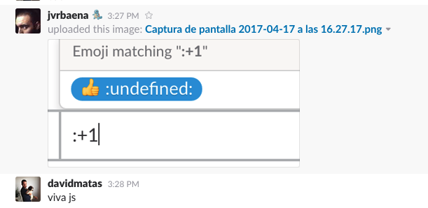

title: Types in JavaScript
output: index.html
controls: false
theme: ./theme-clean

-- cover center

# Adding types to JavaScript

-- center

> After having used TypeScript for nearly a year, I have to confess: I never want to start a new project without it again.

<div class="avatar">
  
  <p><a href="https://twitter.com/tomdale">Tom Dale</a></p>
</div>

<p class="source">https://medium.com/@tomdale/glimmer-js-whats-the-deal-with-typescript-f666d1a3aad0</p>

--

> Big JavaScript codebases tend to become "read-only".

<div class="avatar">

<p><a href="https://twitter.com/ahejlsberg">Anders Hejlsberg</a></p>
</div>

<p class="source">https://channel9.msdn.com/Events/Build/2016/B881</p>

--

## One of the reason is the lack of type signature

--

## No type signature

```javascript
export const cancelRequests = (requestsActions) =>
  compose(
    map(endpoint => cancelRequest(endpoint)),
    filter(endpoint => !!endpoint),
    map(action => action.endpoint),
  )(requestsActions);
```

--

## Same code with types

```typescript
type RequestAction = { type: 'request', endpoint: string};
type CancelAction = { type: 'cancel', endpoint: string };

export const cancelRequests = (requests: RequestAction[]): CancelAction[] =>
  compose(
    map(endpoint => cancelRequest(endpoint)),
    filter(endpoint => !!endpoint),
    map(action => action.endpoint),
  )(requests);
```

--

# We have tried to solve this problem using

--

## JSDoc

```javascript
/**
* Converts an IDL into a understandable text
* @param {Object} idl - The Intermediate Definition Language
* @param {Boolean} useHTML - True to get a formatted text
* @return {String}
*/
app.monitoring.stringifyIDL = function(idl, useHTML) {
  var arr = _stringifyIDL(idl, useHTML);
  return arr.length ? arr[0] : '';
};
```

* Problem: You have to trust that the person who wrote the code documented it correctly and that people who changed it later correctly updated the documentation.

--

## React's PropTypes

```javascript
Account.propTypes = {
  account: PropTypes.shape({
    id: PropTypes.number.isRequired,
    screenName: PropTypes.string,
    name: PropTypes.string.isRequired,
  }),
  hasAccess: PropTypes.func,
  isAdmin: PropTypes.func,
};
```

* Problem: Just for React components. Limited expressiveness.

--

# Solution: 

# Use a type system

--

## Benefits of using types

* Type systems make code easier to maintain
* Types can make code more readable
* Types can make code easier to analyse
* Types can allow for reliable refactoring
* Types can allow for generally better IDE support
* Types can catch some (type related) errors early

--

## Types can catch errors early



--

## Types can give us better error information

```javascript
var x = 10
var y = x.parent
console.log(y.name)

//VM147:4 Uncaught TypeError: Cannot read property 'name' of undefined
```

--

## We are not talking about an “alternative” JavaScript (Sorry CoffeScript fans)

--

## Typescript vs Flow

(JavaScript fatigue?)

--

# TypeScript

* Its a superset of javascript
* By Microsoft
* Ease of use and tool support over soundness
* Based on ES6 (probably ES7/ES8)
* Adds optional type annotations, visibility and decorators
* Compiler checks and transpile to ES3/ES5/ES6
* 2.x with major changes released recently

--

# Flow

* Its a superset of javascript
* By Facebook
* No runtime exceptions as goal
* Not a compiler, but checker
* Type annotations can very easily be removed by babel for runtime

--

# TypeScript vs Flow

https://github.com/niieani/typescript-vs-flowtype

--

# TypeScript > Flow

* Better IDE integration (VSCode and IntelliJ IDEA)
* Third-party library definition
* Speed

--

# Typescript

--

## Type inference

```javascript
var foo = 123;
foo = '456'; // Error: cannot assign `string` to `number`
```

--

## Union types

```typescript
function formatCommandline(command: string[]|string) {
    if (typeof command === 'string') {
        return command.trim();
    } else {
        return command.join(' ').trim();
    }
}
```

--

## Intersection types

```typescript
function extend<T, U>(first: T, second: U): T & U {
    
}

var x = extend({ a: "hello" }, { b: 42 });

// x now has both `a` and `b`
var a = x.a;
var b = x.b;
```

--

## Discrimination unions

```typescript
interface Square { kind: "square"; size: number; }
interface Rectangle { kind: "rectangle"; width: number;height: number; }
type Shape = Square | Rectangle;

function area(s: Shape) {
    if (s.kind === "square") return s.size * s.size;
    else return s.width * s.height;
}

```

--

## Generics
```typescript
function reverse<T>(items: T[]): T[] {
}
```

--
## Lookup types

```typescript
function getProperty<T, K extends keyof T>(obj: T, key: K) {
    return obj[key];  // Inferred type is T[K]
}
let x = { foo: 10, bar: "hello!" };
let foo = getProperty(x, "foo"); // number
```

--

## Mapped Types
```typescript
interface Person {
    name: string;
    age: number;
    location: string;
}
type Readonly<T> = {
    readonly [P in keyof T]: T[P];
};
type PartialPerson = Partial<Person>;
```

--

# Thinking with types

https://jaredforsyth.com/type-systems-js-dev

--

# Write down data types first

--

# Avoid clever code

--

> Everyone knows that debugging is twice as hard as writing a program in the first place. So if you're as clever as you can be when you write it, how will you ever debug it?
> Brian Kernighan

--

clever
```javascript
props['on' + (fastClick ? 'MouseDown' : 'Click')] = myFn
```
unclever
```typescript
  if (fastClick) {
    props.onMouseDown = myFn
  } else {
    props.onClick = myFn
  }
```  
--

> If it's hard to type check, it's probably hard to understand

--

## Migration: Slack

https://slack.engineering/typescript-at-slack-a81307fa288d

--

## Migration: Gradual typing

> JavaScript is valid TypeScript, meaning that one can use TypeScript without changing a single line of code. This allowed us to use “gradual typing” by enabling the compiler and the static analysis early, without suspending work on critical bug fixes or new features.

--

## Migration: Found existing bugs

> First, we were surprised by the number of small bugs we found when converting our code

--

## Migration: Tooling

> Second, we underestimated how powerful the editor integration is. Thanks to TypeScript’s language service, editors with an autocomplete function can support the development with context-aware suggestions. TypeScript understands which properties and methods are available on certain objects, enabling your editor to do the same. An autocomplete system that only uses words in the current document feels barbaric afterward.

--

## Migration: Duration

> It’s taken about six months to annotate most of the JavaScript in the desktop app code base.

--

## Migration: Developers training

> Developers who have experience using any strongly-typed language usually pick up the syntax within an hour or two

--

## Migration: Audiense

* Replace Babel with TypeScript
* We found a bug in TypeScript 2.3 related to jsx and object spread. (fixed in ~1 week)
* Gradual typing
* Prettier support
   

--

## Conclusion

--

## Should you use a type checker?

* your project does not live for long: no
* your project is really simple: no
* there is a chance you will need to refactor the thing: yes
* your system is very important or even crucial for the success of your company: yes
* people enter or leave your team frequently: yes
* you have substantial amount of algorithmic code: yes


http://djcordhose.github.io/flow-vs-typescript/elm-flow-typescript.html#/49


<script async src="http://platform.twitter.com/widgets.js" charset="utf-8"></script>
<script type="text/javascript">
    var _gaq = _gaq || [];
    _gaq.push(['_setAccount', 'UA-31904298-1']);
    _gaq.push(['_trackPageview']);

    (function() {
        var ga = document.createElement('script'); ga.type = 'text/javascript'; ga.async = true;
        ga.src = ('https:' == document.location.protocol ? 'https://ssl' : 'http://www') + '.google-analytics.com/ga.js';
        var s = document.getElementsByTagName('script')[0]; s.parentNode.insertBefore(ga, s);
    })();
</script>


